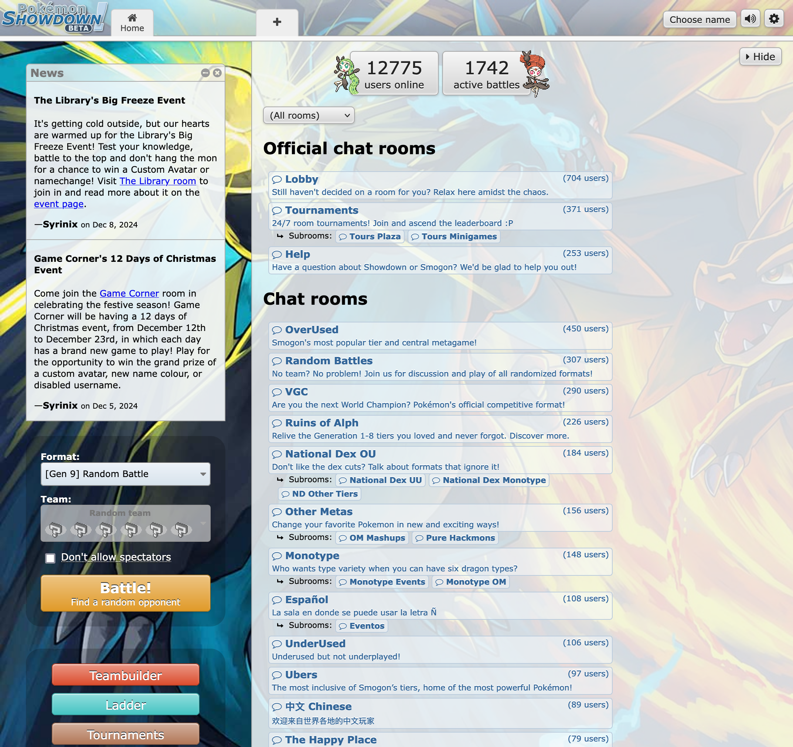
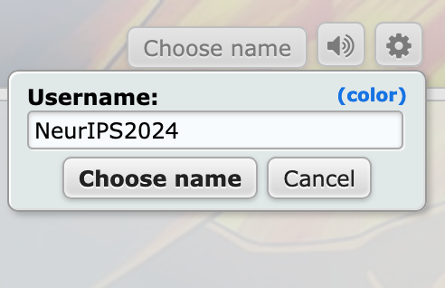
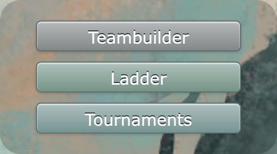
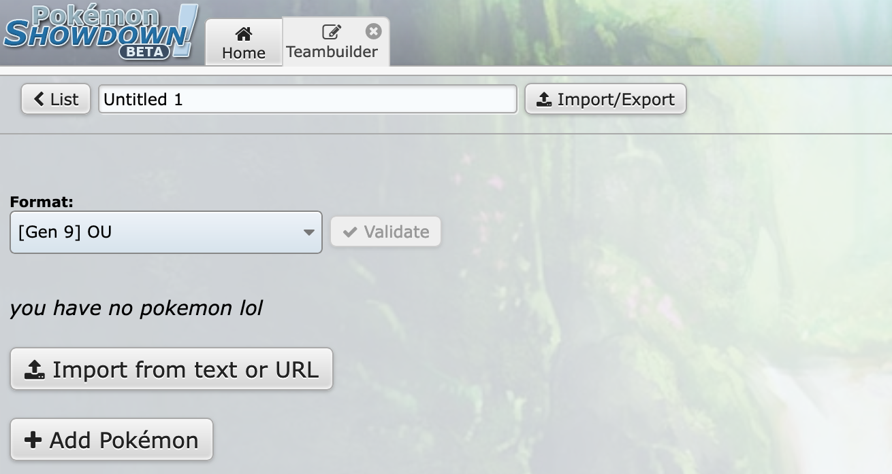
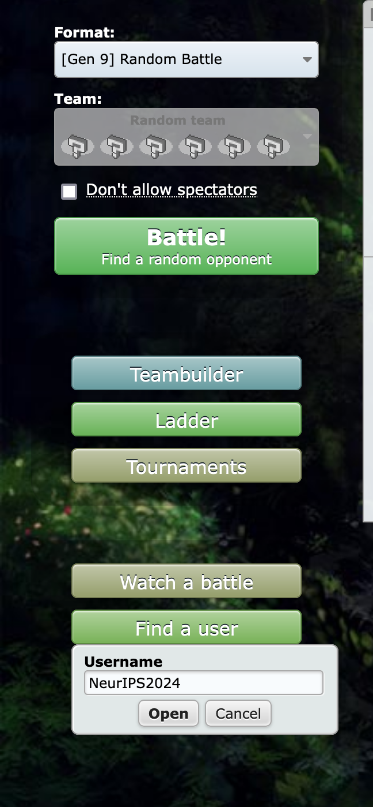
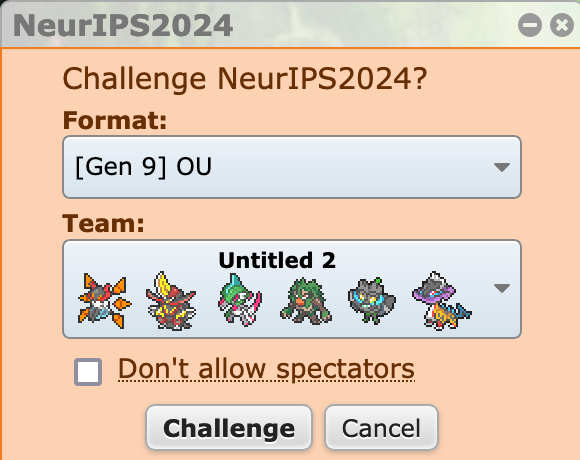

## Challenge PokéChamp on Pokémon Showdown

During NeurIPS on Dec 11th through December 15th, we will be hosting an online challenge to try to beat PokéChamp in a battle. There will be rotating methods available in the paper to challenge. A live demo will be also be available at the Language Gamification workshop on Saturday.

Follow these steps to challenge user NeurIPS2024 using the sample team:

1. **Access Pokémon Showdown**
   - Open your web browser and go to https://play.pokemonshowdown.com/

   

2. **Set Up Your Account**
   - Click "Choose name" in the top right corner
   - Select an available username of your choice

   

3. **Import the Sample Team**
   - Click "Teambuilder"
   - Select "Import from text or URL"
   - Copy and paste the contents of `sample_team.txt` into the text box
   - Choose "OU" as the format and click "Validate"

   
   

4. **Initiate the Challenge**
   - Return to the home screen
   - Click "Find a user"
   - Enter "NeurIPS2024" in the search box
   - Select "[Gen9] OU" as the format
   - Click "Challenge" to start the battle

   
   

Good luck with your Pokémon battle!

We will be doing a full code release at a later date post NeurIPS.